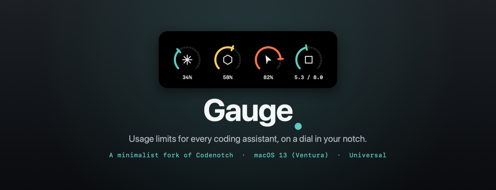

<div align="center">



<br/>

<a href="../../releases/latest/download/Gauge.dmg"></a>

<br/><br/>


[](https://github.com/vinzdg/codenotch)

</div>

---

**Gauge** pins a small dial to a screen edge and shows how much of each coding
assistant's usage limit you've burned — and whether it's still working, done, or
waiting on you. It's a minimalist fork of
[Codenotch](https://github.com/vinzdg/codenotch) by Vinz, backported to run on
**macOS 13 (Ventura)**, built **universal** (Intel + Apple Silicon), with its own
look: a segmented gauge dial in place of the full ring, a calm teal accent, and
its own icon.

Hover a dial for its limit windows and when they reset — Claude's shows the same
**current session** window `claude /usage` leads with, so the two never disagree.
A thin arc spins inside a dial while a session is busy, and the notch opens itself
for a few seconds when an agent finishes or stops to ask you something. Opt-in
dials for the Mac's own **RAM**, **CPU** and **GPU** sit at the end of the strip,
so what you're spending and what it's costing the machine read side by side.

## ✦ &nbsp;What makes it Gauge

| | |
|---|---|
| **macOS 13 (Ventura) and up** | Upstream needs macOS 15. The deployment target is 13.0 and every newer API sits behind an availability check, so newer-OS flourishes fall back gracefully on Ventura. |
| **Universal / Intel build** | A GitHub Actions workflow cross-compiles an `x86_64 + arm64` disk image that runs on Intel Macs. |
| **The dial** | A **270° segmented gauge** open at the bottom with a needle tip, in place of the full ring — a calm **gauge teal** (`#4FBFB3`) accent, monospaced readings, and a gauge for the app and menu-bar icons. |
| **The Mac's own meters** | Opt-in dials for **RAM**, **CPU** and **GPU**, on the same gauge as the providers — see *The Mac's own meters* below. |
| **Auto-update off** | Sparkle is disabled — the official feed only serves macOS 15 builds. |

Everything else works as in upstream — the providers it reads (Claude Code,
Cursor, Codex, Copilot, Gemini, GLM, Grok, local Ollama / LM Studio, and more),
notch placement on any screen edge, session alerts, and the phone link. See the
[Codenotch README](https://github.com/vinzdg/codenotch#readme) for the full
provider list and how each reading is sourced.

## ▦ &nbsp;The Mac's own meters

Gauge also reads the machine it runs on. Three more dials sit at the end of the
strip, drawn on the same gauge and hovering the same way as the providers:

| | |
|---|---|
| **RAM** | The share of memory in active use — what's active, wired and compressed over the physical total. Cached and purgeable pages are left out on purpose: macOS keeps those full by design, so counting them would pin the dial near the top and say nothing. The hover card gives the figure in GB. |
| **CPU** | The share of time the cores spent busy between two samples — user, system and nice over everything including idle, summed across cores. It's a **rate, not a total**: the kernel only offers counters that climb since boot, so the dial reads what the Mac is doing now rather than what it has done all week. |
| **GPU** | The busiest accelerator's load, taken from the graphics driver's own figure in the IO registry. On a dual-GPU Intel Mac that's whichever of the integrated and discrete chip is working, since the idle one would otherwise mask it. |

Each one switches on independently under **Settings → Appearance → Notch**, and
all three ship **off** — the notch has only so much width, and the point is that
you pick the ones you care about.

The GPU figure has no public API. `powermetrics` is the documented route and it
needs root, which a menu-bar app can't have, so Gauge reads the driver's
`PerformanceStatistics` dictionary instead — no entitlement, no root, but no
contract either: the key names differ by GPU family. When nothing recognisable
is published, **the dial doesn't appear at all**. A missing meter is honest; one
pinned at zero on hardware we can't read would be a lie.

## ↓ &nbsp;Install

The <a href="../../releases/latest/download/Gauge.dmg">**Download**</a> button is
the disk image itself — a rolling **latest** release the CI rebuilds and
republishes on every push to `ventura-intel`, so `Gauge.dmg` always resolves to
the newest build.

Drag **Gauge** to `/Applications`, then clear the quarantine flag once — the
build is ad-hoc signed (no Developer ID), so macOS quarantines it:

```sh
xattr -dr com.apple.quarantine /Applications/Gauge.app
```

> If macOS says the app is *damaged*, that's the quarantine flag rather than a
> bad download — run the command above.

Universal binary, macOS 13 (Ventura) or later, Intel or Apple Silicon. Prefer a
specific commit's build? Every run of the **Ventura Intel build** workflow (the
**Actions** tab) also keeps the dmg as a downloadable artifact.

## ⚙ &nbsp;Build from source

```sh
brew install xcodegen create-dmg   # once
make run                           # generate, build, launch a Debug build
make dmg-ci ARCH=x86_64            # the CI disk image (cross-compiles the Intel slice)
```

No signing identity is required. The product is **Gauge.app**, while the Xcode
target, scheme and bundle id stay `Codenotch` / `com.vinz.codenotch` on purpose:
CI, the login-keychain “Always Allow” grant and the stored preferences all key
off those, so renaming only the product keeps settings and builds intact. Run
with `CODENOTCH_DEMO=1` to see fixed sample data instead of live readings.

## ♥ &nbsp;Credits & license

Gauge is a fork of **[Codenotch](https://github.com/vinzdg/codenotch)** by Vinz
and its contributors. All of the original design, architecture and provider work
is theirs; this fork only backports it to macOS 13 / Intel and reskins it.

[MIT](LICENSE) © 2026 Vinz. &nbsp;Ventura / Intel fork (“Gauge”) by Lucas Roberto.
